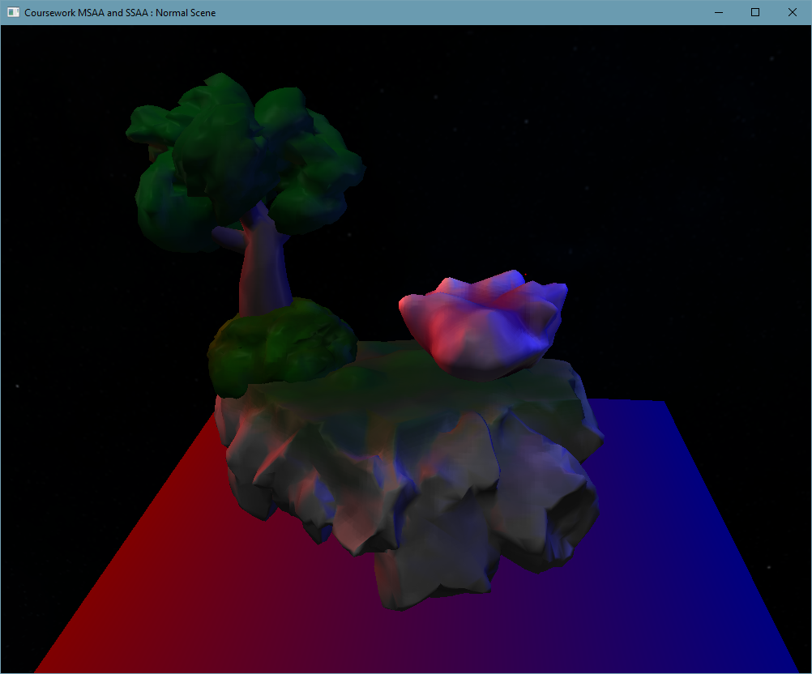

# OpenGL-MSAA-SSAA
 A uni coursework. OpenGL implementation of MSAA and SSAA and performance comparison.
 
 Implementation in [OpenGL folder](Coursework/OpenGL) and [Shaders folder](Coursework/OpenGL/Resources/Shaders)
 
 SSAA is performed by creating an FBO and rendering the image to the texture. [SSAA shader](Coursework/OpenGL/Resources/Shaders/SSAA.fs)

Supersampling patterns implemented:
 - FlipTri
 - FlipQuad
 - RGSS
 - Quincux
 - Grid
 
 
